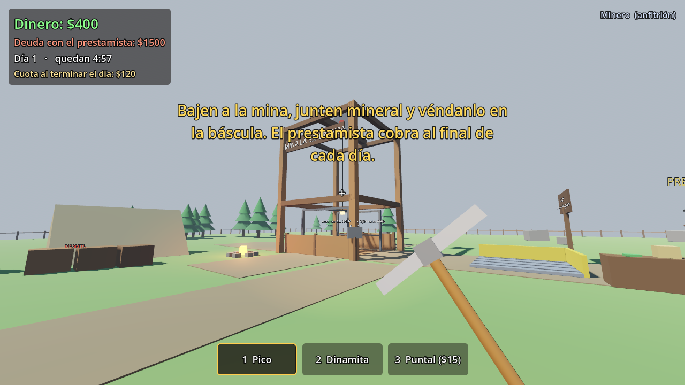
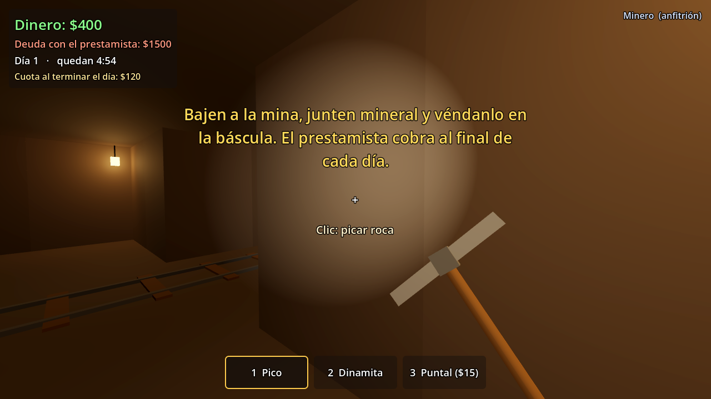
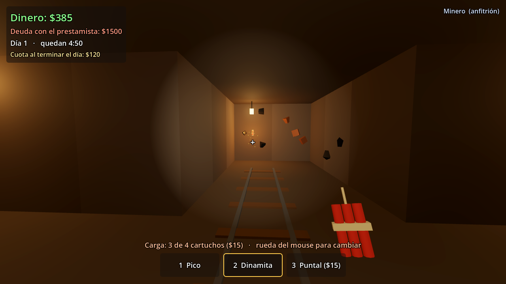
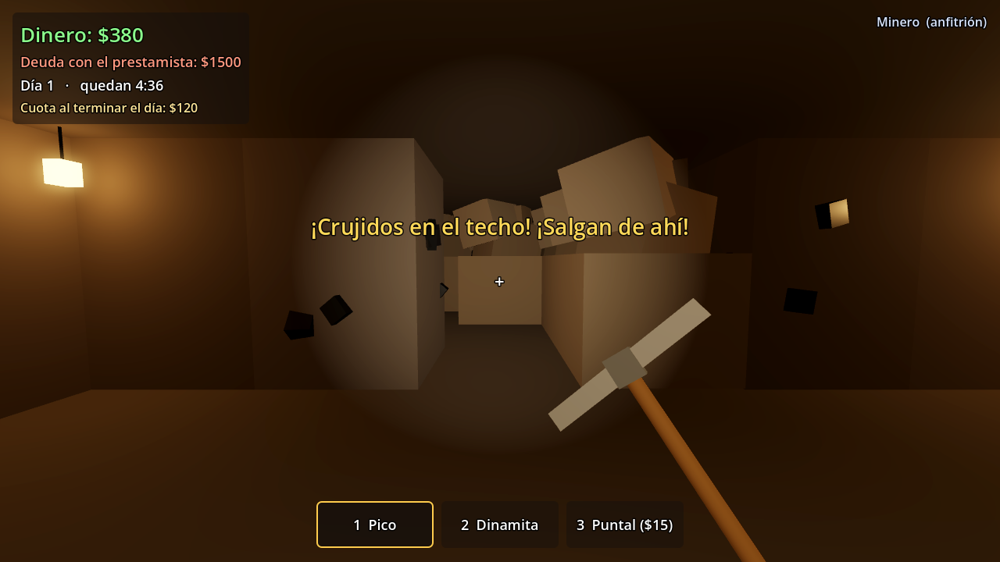

# Mineros Endeudados (prototipo)

Cooperativo de 2 a 4 jugadores en primera persona. Le deben una fortuna a un prestamista turbio
y bajan a una mina inestable para pagarle. La dinamita rinde más, pero puede tirarles el techo encima.

Es el **primer prototipo** de la idea 3 del [plan del juego](docs/plan-juego-steam.md): sirve para
comprobar si el bucle es divertido antes de invertir en arte, sonido y contenido.

| Superficie | Mina |
|---|---|
|  |  |
| **Dinamita encendida** | **Después de un derrumbe** |
|  |  |

## Qué tiene el prototipo

- **Multijugador cooperativo sin servidores:** un jugador es el anfitrión y los demás se conectan a él
  (por IP/red local, o por Steam con el plugin GodotSteam).
- **Mina generada** a partir de una semilla, con vetas de carbón, hierro, plata y oro.
  Cuanto más lejos del pozo, más ricas (en el juego completo esto será la profundidad).
- **Pico** (lento y seguro) y **dinamita de 1 a 4 cartuchos**: más cartuchos rompen más roca
  y sueltan más mineral, pero tienen más riesgo de derrumbe.
- **Estabilidad que se nota sin números:** en las zonas castigadas cae polvo del techo, se escuchan
  crujidos y tiembla la cámara. Antes de un derrumbe hay 1,6 segundos de aviso.
- **Derrumbes:** tapan los túneles con escombros (se pueden picar) y entierran el mineral que haya debajo.
- **Puntales** ($15): cada uno cerca de la explosión reduce el riesgo a la mitad.
- **Montacargas** manejado entre todos: el panel de arriba es rápido, pero si se suelta el botón a toda
  velocidad la carga sale volando y el carrito "se descarrila". El de abajo es lento pero seguro.
  Los dos tienen una campana para avisar.
- **Carrito físico** y objetos que se agarran, empujan y lanzan (con la física ridícula incluida).
- **Báscula:** todo el mineral que se deje encima se vende, también el que está dentro del carrito.
- **El prestamista** cobra una cuota al final de cada día (5 minutos). Si no alcanza, aplica un recargo
  y una advertencia; a la tercera se queda con la mina y la partida vuelve a empezar.
- **Sonidos generados por código** (provisorios) y gráficos de cajas de colores, estilo low-poly.

## Cómo abrirlo

1. Descargar **Godot 4.7** (la versión estándar, no la de .NET) desde <https://godotengine.org/download>.
2. Abrir Godot → **Importar** → elegir el archivo `project.godot` de esta carpeta.
3. Pulsar **F5** para jugar.

Usa el renderizador "Compatibilidad" (OpenGL), así funciona también en computadoras modestas.

## Jugar con amigos

### Por IP o red local (para probar)

- Uno pulsa **Crear partida**; los demás escriben la IP del anfitrión y pulsan **Unirse por IP**.
- Usa el puerto **UDP 24567**. Por internet hay que abrir ese puerto en el router del anfitrión
  (por eso la versión para Steam usa los lobbies de Steam, que no necesitan abrir puertos).
- Para probar solo en una computadora: en el editor, **Depurar → Personalizar instancias de ejecución**,
  elegir 2 instancias y ponerles como argumentos `-- --host` a la primera y `-- --join=127.0.0.1` a la segunda.

### Por Steam

1. Instalar el plugin **GodotSteam** para Godot 4 (la versión GDExtension, con `SteamMultiplayerPeer`),
   desde la AssetLib del editor o desde <https://godotsteam.com>.
2. Tener Steam abierto. Mientras no haya un App ID propio se usa el **480 ("Spacewar")**, la app de prueba
   de Valve. El App ID se cambia en `scripts/autoload/net.gd` (`STEAM_APP_ID`).
3. Pulsar **Crear partida en Steam** → **Esc** → **Invitar amigos de Steam**. El amigo acepta la invitación
   desde Steam y entra directo a la partida.

> **Importante:** la parte de Steam está escrita según la API de GodotSteam, pero **todavía no se probó con
> Steam real** (en el entorno donde se programó no hay Steam). Si el plugin cambió algún nombre de función,
> el error va a aparecer en `scripts/autoload/net.gd`. El modo por IP sí está probado con pruebas automáticas.

## Controles

| Tecla | Acción |
|---|---|
| WASD | Moverse |
| Shift | Correr |
| Espacio | Saltar |
| Mouse | Mirar |
| Clic izquierdo | Usar herramienta / lanzar lo que se tiene agarrado |
| E | Agarrar, empujar el carrito, soltar; mantener sobre los botones del montacargas |
| 1 / 2 / 3 | Pico / Dinamita / Puntal |
| Rueda del mouse (o + / -) | Cantidad de cartuchos de dinamita |
| Esc | Pausa (invitar amigos, salir) |
| F3 | Datos de depuración (estabilidad y riesgo en números, para ajustar el balance) |

## Cómo se juega

1. El carrito empieza sobre el montacargas. Alguien se queda arriba manejando (panel rápido)
   y los demás bajan.
2. Abajo se pica o se vuela roca. El mineral cae en trozos que hay que juntar en el carrito.
3. Se sube el carrito (¡sin frenar de golpe!) y se empuja hasta la **báscula**, junto al prestamista.
4. Con la plata se compra más dinamita y puntales, y se paga la cuota del día.

## Estructura del proyecto

```
project.godot              Configuración (autoloads, física Jolt, renderizador)
scenes/main.tscn           Escena principal (solo carga scripts/main.gd)
scripts/
  main.gd                  Menú ↔ partida; opciones de línea de comandos
  autoload/
    net.gd                 Conexión: ENet (IP) y Steam (GodotSteam, cargado de forma dinámica)
    controls.gd            Teclas y botones del mouse
    sfx.gd                 Sonidos generados por código
  core/
    config.gd              TODOS los números de balance (precios, riesgos, tiempos)
    mats.gd                Materiales y mallas compartidas
    fx.gd                  Partículas, destellos y textos flotantes
  world/
    world.gd               La partida: reglas, red (RPC) y simulación del anfitrión
    mine_grid.gd           La mina (grilla de columnas generada por semilla)
    lift.gd                El montacargas
    level_builder.gd       Superficie, pozo, báscula, prestamista, campamento
  entities/entity.gd       Objetos físicos: mineral, carrito, dinamita, puntales
  player/player.gd         Minero en primera persona
  ui/hud.gd, ui/menu.gd    Interfaz
  dev/autotest.gd          Prueba automática anfitrión + cliente
  dev/photo_tour.gd        Recorrido de capturas de pantalla
docs/                      Plan del juego y capturas
```

**Cómo funciona la red:** el anfitrión simula todo (física, mina, dinamita, dinero). Cada jugador mueve
su propio minero y le manda pedidos al anfitrión ("picar esta celda", "poner dinamita acá"). La mina
se genera igual en todas las computadoras a partir de la semilla, y solo viajan los cambios. Quien entra
a una partida empezada recibe una "foto" completa del estado.

## Ajustar el balance

Todo está en `scripts/core/config.gd`: precio de cada mineral, costo de la dinamita y los puntales,
radio de las explosiones, probabilidad de derrumbe por cartucho, velocidad del montacargas,
duración del día, deuda inicial y cuotas. F3 muestra los números en el juego.

## Pruebas automáticas

Recorren las mecánicas principales con un anfitrión y un cliente reales conectados por red, y comprueban
que los dos vean la misma mina y los mismos objetos:

```sh
godot --headless --path . -- --host --autotest --expect=1 &
godot --headless --path . -- --join=127.0.0.1 --autotest
```

Cada una termina con `AUTOTEST OK` (o con la lista de lo que falló). También hay un recorrido que guarda
capturas de pantalla: `godot --path . -- --host --tour=/carpeta/de/salida`.

## Próximos pasos

- **Probarlo con otras personas**: es lo único que dice si es divertido.
- Rescate de compañeros atrapados por un derrumbe (excavar antes de que se acabe el aire).
- Profundidad real: más niveles (hierro → plata → oro → gemas → algo raro) y peligros (gas, agua).
- Mejoras entre sesiones (mejor dinamita, lámparas, montacargas más rápido) y **guardado de la partida**.
- Precio del mineral que cambia cada día y el "doble o nada" del prestamista.
- Arte de verdad (Kenney, Quaternius), sonidos y música.
- Abrir la página "Próximamente" en Steam lo antes posible para juntar wishlists.
